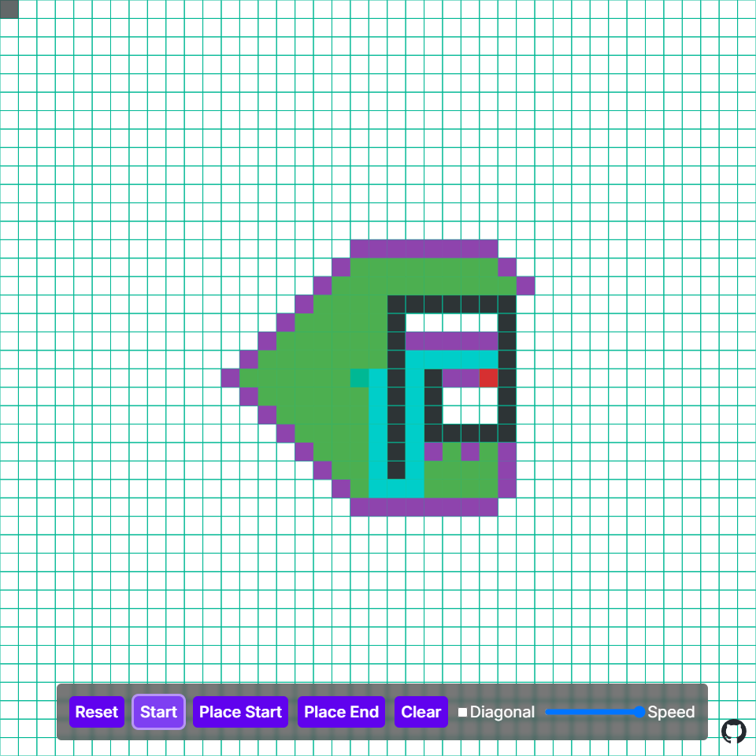

[Kuesuto](/projects/kuesuto) is my Zelda-inspired pixel-art action RPG, and at some point its enemies needed to stop walking into walls. An enemy that aggros onto the player has to navigate around obstacles in real time, every frame, in a world where "can I stand here" is decided by an AABB collision system - not by a tidy grid of 0s and 1s.

That last part is why I ended up writing my own library. In November 2023 I built [pather](https://github.com/Arcia125/pather), a small, typed, zero-dependency A* library for 2D games, and published it as [@arcia125/pather](https://www.npmjs.com/package/@arcia125/pather). This post is about the one design decision that shaped it, and what five days of building it looked like.

## No Grid, Just Questions

Most pathfinding libraries want you to hand them a matrix: build a 2D array where `1` means wall, pass it in, get a path back. That's fine until your game's source of truth isn't a matrix. Kuesuto's collision is entity-based - hitboxes, corners, moving things. Maintaining a parallel walkability grid and keeping it in sync with the real collision system is exactly the kind of bug farm I didn't want.

So pather inverts the relationship. You don't give it your world; it asks you questions about your world, through two callbacks:

```ts
import { findPath } from '@arcia125/pather';

const path = findPath({
  startPos: { x: 0, y: 0 },
  endPos: { x: 4, y: 4 },
  wouldCollide: (node) => grid[node.y][node.x] === 1,
  isOutOfBounds: (node) => typeof grid?.[node.y]?.[node.x] === 'undefined',
});
```

Here the callbacks happen to read a grid, but they can run anything. The library never owns or copies your world data - a tilemap, a physics query, a procedural chunk lookup, all the same to it.

## What That Buys You in a Real Game

The payoff shows up at the actual call site in Kuesuto's aggro capability, where enemies chase the player:

```ts
this.path = findPath({
  startPos: positionToTileCoord({ x: this.entity.state.x, y: this.entity.state.y }),
  endPos: positionToTileCoord({ x: position.x, y: position.y }),
  isDone: (node, endNode) =>
    Math.abs(node.position.x - endNode.position.x) <= 2 &&
    Math.abs(node.position.y - endNode.position.y) <= 2,
  wouldCollide: (node) => Collision.checkCollision(gameState, {
    ...this.entity,
    state: { ...this.entity.state, x: fromTileCoord(node.position.x), y: fromTileCoord(node.position.y) },
  }).collidedCorners.length > 0,
  isOutOfBounds: (node) => gameState.map.isTileOutOfBounds(node),
});
```

Three decisions are visible in that snippet:

- **`wouldCollide` runs the game's real collision system** with a hypothetical entity position. The pathfinder asks the same code the physics uses, so an enemy can never path somewhere it physically can't stand. No parallel grid to desync.
- **`isDone` is a pluggable predicate**, not a hardcoded equality check. An enemy chasing a moving player shouldn't insist on reaching the exact tile the player occupied when the search started - "within two tiles" is close enough to start swinging.
- **The search runs a lot.** Enemies take the first step of the path and re-path as the player moves, so per-frame cost matters more than perfect optimality. That's also why there's a `maxIterations` safety valve (added the same day as the first release): an unreachable target must not lock the frame.

## A Generator That Shows Its Work

The feature I'm most fond of is `findPathGen`, a generator version of the algorithm that yields after every single node expansion:

```ts
public *findPathGen() {
  while (this.possibleNodes.length) {
    if (this.iterations >= this.config.maxIterations) return;
    const solution = this.checkNode();
    this.iterations++;
    yield { solution, aStar: this };
    if (solution?.path) return;
  }
}
```

Because each yield exposes the search's open and closed sets, you can render the algorithm mid-thought without threading rendering callbacks through it. That's what powers the [interactive demo](https://arcia125.github.io/pather/) in the image at the top of this post: green cells are explored, purple is the frontier, and the teal path draws itself once the goal is found. You can paint walls with click-and-drag, move the start and end points, toggle diagonal movement, and watch the search adapt.

The demo ended up being a small game engine in its own right - fixed-timestep loop, 60 FPS cap, delta accumulation - which felt fitting, given where the library came from.

## Five Days, Start to Finish

The whole project spans November 10-14, 2023, and the commit history is honest about how these things actually go. Day one: algorithm written, README, MIT license, then roughly ten consecutive `update package.json` commits fighting npm scoped-package publishing before v1.0 landed on the registry. Day two: the demo, a real bug fix (`findPath` had to be called twice because the open list was seeded with stale state), and `findPathGen`. Day three: tests with Vitest. Day five: drag-to-draw walls in the demo, and v1.3.3 - the version that's still current.

The build setup is Vite in library mode with `vite-plugin-dts`, shipping dual ESM/CJS output with full type declarations and zero runtime dependencies. Kuesuto consumes it from npm like any other package, which forced me to treat my own library like a real dependency rather than a folder I could reach into.

## The Honest Tradeoffs

Pather is deliberately simple, and some of that simplicity is a real cost:

- **No binary heap.** The open list is a plain array, re-sorted every expansion, and membership checks are linear scans. For the small grids and short chase paths in Kuesuto this is fine; for a big RTS map it wouldn't be. A priority queue is the obvious first upgrade.
- **No weighted movement.** Every step costs 1, including diagonals. Combined with the default Manhattan heuristic, that means diagonal mode isn't guaranteed to return the shortest path - Manhattan overestimates when diagonal moves are allowed. The `heuristic` option is the escape hatch if you need octile distance.
- **No corner-cutting check.** A diagonal move can squeeze between two walls that meet at a corner. In Kuesuto this never mattered because enemies re-check real collision every step, but it's a sharp edge for grid-only users.
- **One quirk of the path contract:** the returned path starts at the first step *after* your start position and includes the goal. The tests encode this; the README could be clearer about it.

None of these were oversights so much as the point where "good enough for the game" beat "textbook complete" - but if I picked it back up, that's the list.

## Try It

```bash
npm install @arcia125/pather
```

Or just play with the [live demo](https://arcia125.github.io/pather/) - drawing a maze and watching the frontier flood around it is the fastest way to build intuition for what A* is actually doing. The source is on [GitHub](https://github.com/Arcia125/pather), MIT licensed.

Writing a pathfinding library to ship a game is arguably a detour. But the callback-driven design meant the game's enemies got pathfinding that respects their real hitboxes for free, and I got a library I actually understand down to every sort and pop. Some detours pay for themselves.
