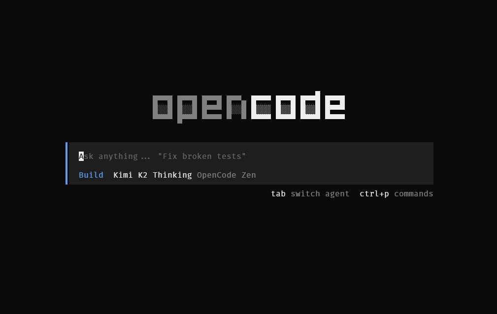

Tired of being locked into expensive AI coding subscriptions? Frustrated that your Claude Code or Copilot investment only works with one provider? **OpenCode** is the open source answer: a terminal-native AI coding agent with 26,000+ GitHub stars that works with your existing Claude Pro subscription, 75+ other providers, or completely free models.

Here is how to get productive in five minutes.

## What Makes OpenCode Different

OpenCode is not just another AI wrapper. It is a full coding agent that understands your codebase:

- **Use your existing subscriptions** - Claude Pro/Max, OpenAI, or GitHub Copilot all work
- **75+ LLM providers** - Switch between cloud, local (Ollama), or free models instantly
- **LSP integration** - Real semantic understanding of your code, not just text matching
- **Plan vs Build workflow** - Safely preview changes before applying them
- **Undo everything** - Made a mistake? One command reverts it

## 5-Minute Setup

### 1. Install OpenCode

```bash
curl -fsSL https://opencode.ai/install | bash
```

Or use your package manager:

```bash
# npm
npm i -g opencode-ai

# Homebrew
brew install sst/tap/opencode

# Chocolatey (Windows)
choco install opencode
```

### 2. Connect Your AI Provider

```bash
opencode auth login
```

Select your provider and enter your API key. **Pro tip**: If you have Claude Pro or Max, select Anthropic. Your subscription works here and it is the most cost-effective option.

### 3. Initialize Your Project

```bash
cd your-project
opencode
```

Once inside OpenCode, run:

```
/init
```

This analyzes your codebase and creates an `AGENTS.md` file that helps the AI understand your project structure, coding patterns, and conventions. This step is what makes OpenCode responses so much more relevant than generic AI tools.

## The Plan vs Build Workflow

This is the killer feature most people miss. OpenCode has two modes, toggled with **Tab**:

**Plan Mode** - The AI analyzes your request and suggests changes without touching any files. You see exactly what it wants to do before it does it.

**Build Mode** - The AI executes changes, creating and modifying files as needed.

The workflow: Start in Plan mode, review the approach, then switch to Build when you are satisfied. This prevents the "AI went rogue and broke everything" problem.

## Essential Commands

| Command | Shortcut | What it does |
|---------|----------|--------------|
| `/init` | - | Analyze project, create AGENTS.md |
| `/undo` | `Ctrl+x u` | Revert the last change |
| `/redo` | `Ctrl+x r` | Restore a reverted change |
| `/share` | - | Generate shareable session link |
| `/themes` | `Ctrl+x t` | Customize appearance |
| **Tab** | - | Toggle Plan/Build mode |

## Choose Your Model

**Free**: Sign up for OpenCode Zen and use GLM-4.7. It is genuinely capable for 80% of coding tasks and costs nothing.

**Best quality**: Connect your Claude Pro/Max or GPT-4 subscription. Same workflow, premium models.

**Maximum privacy**: Run local models through Ollama. Your code never leaves your machine.

The key insight: your workflow stays identical regardless of which model you use. Switch based on task complexity, budget, or privacy needs.

## Why I Made the Switch

I was tired of the lock-in. Claude Code only works with Claude. Copilot only works with OpenAI models. Every tool wanted its own subscription.

OpenCode flipped that: I use my existing Claude Pro subscription when I need quality, GLM-4.7 for quick tasks, and local models for client work that cannot touch external APIs. Same interface, same commands, same muscle memory.

That flexibility is worth the switch.

---

**Get started**: [opencode.ai/docs](https://opencode.ai/docs)

**Try free models**: [opencode.ai/zen](https://opencode.ai/zen)

**Install now**:
```bash
curl -fsSL https://opencode.ai/install | bash
```
