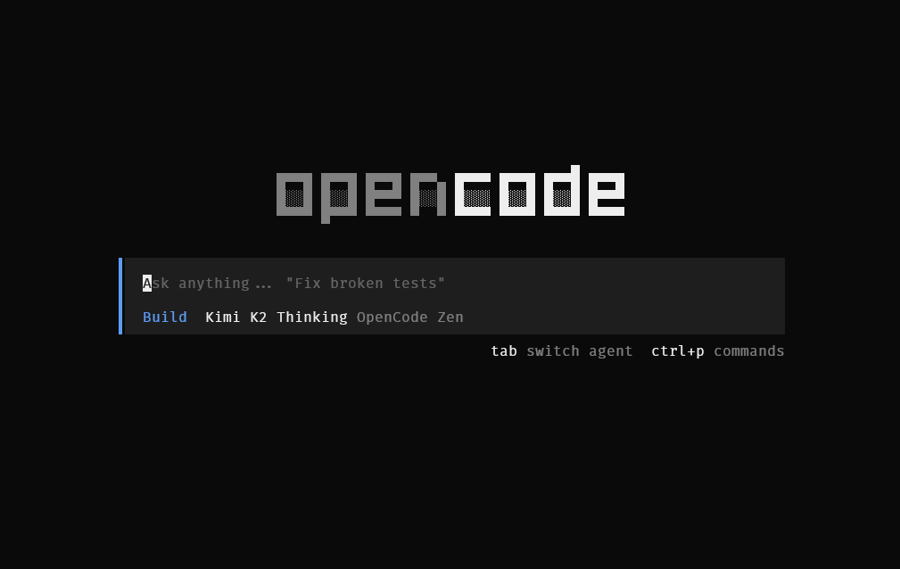

*Updated August 2026: Anthropic no longer permits third-party tools to authenticate with Claude Pro or Max subscriptions. The provider guidance below reflects the current state.*

Tired of being locked into expensive AI coding subscriptions? Frustrated that your Copilot investment only works with one provider? **OpenCode** is the open source answer: a terminal-native AI coding agent with 190,000+ GitHub stars that works with the ChatGPT Plus or Copilot subscription you already pay for, 75+ providers by API key, or completely free models.

Here is how to get productive with it.

## What Makes OpenCode Different

OpenCode is not just another AI wrapper. It is a full coding agent that understands your codebase:

- **Use your existing subscriptions** - ChatGPT Plus/Pro, GitHub Copilot, and GitLab Duo authenticate directly (Anthropic is the exception, see below)
- **75+ LLM providers** - Switch between cloud, local (Ollama), or free models instantly
- **LSP integration** - Real semantic understanding of your code, not just text matching (opt-in, enable it in your config)
- **Plan vs Build workflow** - Safely preview changes before applying them
- **Undo everything** - Made a mistake? One command reverts it

## Setup

### 1. Install OpenCode

```bash
curl -fsSL https://opencode.ai/install | bash
```

Or use your package manager:

```bash
# npm
npm i -g opencode-ai

# Homebrew
brew install anomalyco/tap/opencode

# Chocolatey (Windows)
choco install opencode
```

### 2. Connect Your AI Provider

```bash
opencode auth login
```

Select your provider. What you can authenticate with depends on which one:

- **Subscriptions that work directly**: ChatGPT Plus/Pro, GitHub Copilot, and GitLab Duo. No API key, no per-token billing. If you already pay for one of these, this is the cheapest good setup available.
- **Anthropic**: API key only. Anthropic prohibits third-party applications from authenticating with Claude Free, Pro, or Max subscriptions, and OpenCode removed its Anthropic OAuth plugin in v1.3.0 following a legal request. You can still run Claude models here, but you pay per token with a key from the Claude Console. If Claude is your only AI subscription, it goes further inside Claude Code itself.
- **Everyone else**: an API key from the provider, or sign in to OpenCode Zen for a curated list including free options.

### 3. Initialize Your Project

```bash
cd your-project
opencode
```

Once inside OpenCode, run:

```
/init
```

This analyzes your codebase and creates an `AGENTS.md` file that helps the AI understand your project structure, coding patterns, and conventions. This step is what makes OpenCode responses so much more relevant than generic AI tools.

## The Plan vs Build Workflow

This is the killer feature most people miss. OpenCode has two modes, toggled with **Tab**:

**Plan Mode** - The AI analyzes your request and suggests changes without touching any files. You see exactly what it wants to do before it does it.

**Build Mode** - The AI executes changes, creating and modifying files as needed.

The workflow: Start in Plan mode, review the approach, then switch to Build when you are satisfied. This prevents the "AI went rogue and broke everything" problem.

## Essential Commands

| Command | Shortcut | What it does |
|---------|----------|--------------|
| `/init` | - | Analyze project, create AGENTS.md |
| `/undo` | `Ctrl+x u` | Revert the last change |
| `/redo` | `Ctrl+x r` | Restore a reverted change |
| `/share` | - | Generate shareable session link |
| `/themes` | `Ctrl+x t` | Customize appearance |
| **Tab** | - | Toggle Plan/Build mode |

## Choose Your Model

**Free**: Sign up for OpenCode Zen and pick something from its free list. The lineup rotates as vendors cycle models in and out while gathering feedback, so check [opencode.ai/zen](https://opencode.ai/zen) for what is currently free. These models are genuinely capable for a lot of everyday coding work and cost nothing.

**Best quality**: Connect a ChatGPT Plus/Pro subscription, or bring an API key for Claude or Gemini and pay per token. Same workflow, premium models.

**Maximum privacy**: Run local models through Ollama. Your code never leaves your machine.

The key insight: your workflow stays identical regardless of which model you use. Switch based on task complexity, budget, or privacy needs.

## Why I Made the Switch

I was tired of the lock-in. Claude Code only works with Claude. Copilot only works with OpenAI models. Every tool wanted its own subscription.

Then Anthropic proved the point for me. In February 2026 it confirmed that Claude Free, Pro, and Max subscriptions cannot be used to authenticate third-party applications, and in March OpenCode merged a pull request titled "anthropic legal requests" that stripped the Anthropic OAuth plugin out entirely. Anyone routing a Claude Max subscription through a terminal agent they did not buy from Anthropic lost that overnight.

That is exactly the lock-in I switched to avoid, and it is the clearest argument I can make for why the switch was worth it. My setup did not break. It re-routed. ChatGPT Plus for quality work, a free Zen model for quick tasks, and local models through Ollama for client work that cannot touch external APIs. Same interface, same commands, same muscle memory. Only the provider behind it changed.

A tool that treats providers as interchangeable survives a provider changing its mind. A tool welded to one vendor does not.

---

**Get started**: [opencode.ai/docs](https://opencode.ai/docs)

**Try free models**: [opencode.ai/zen](https://opencode.ai/zen)

**Install now**:
```bash
curl -fsSL https://opencode.ai/install | bash
```
