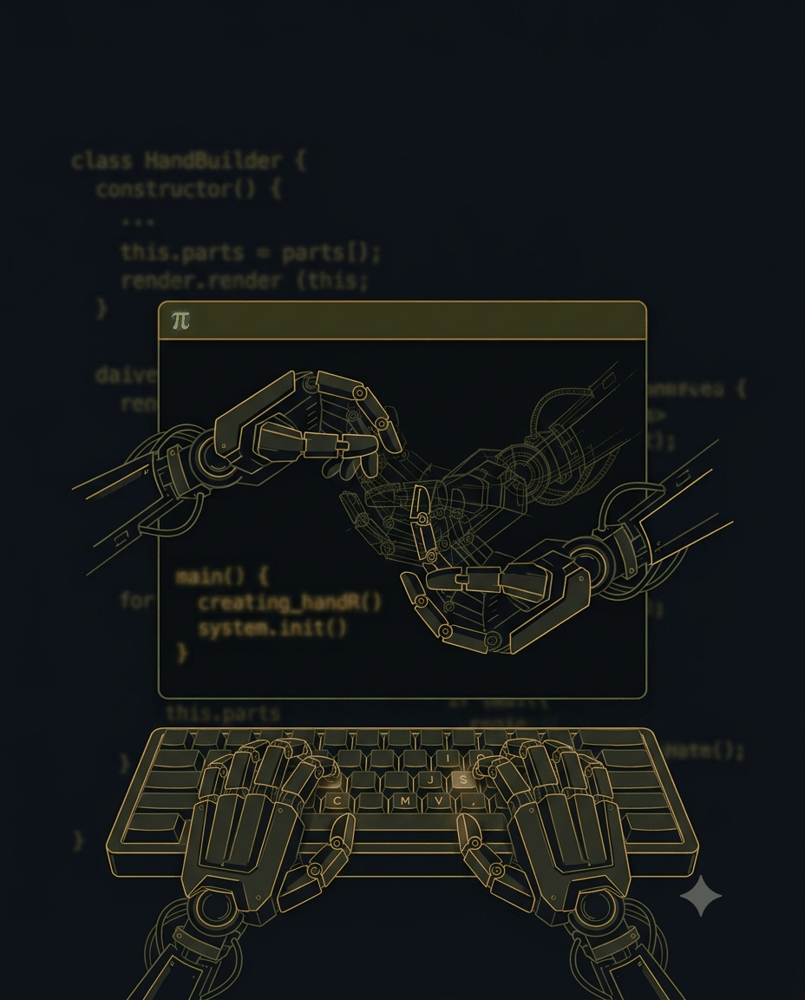

The most impressive thing I've watched a coding agent do this year had nothing to do with application code. I asked [pi](https://pi.dev) for a feature it didn't have, and it went and read its own extension docs, wrote a TypeScript extension against its own API, and the feature existed. On the first try, most of the time.

I've been running pi at work for a while now, including as the base for a custom harness. This post is about the moment that sold me on it.

## What pi Is

pi is a deliberately minimal coding agent harness created by Mario Zechner (of libGDX fame), now stewarded by Earendil. The pitch, straight from the [README](https://github.com/earendil-works/pi): adapt pi to your workflows, not the other way around. It ships a small set of tools (read, write, edit, bash, plus grep/find/ls) and a system prompt designed to stay tiny - and then it refuses, on purpose, to ship the features every other agent brags about:

- No MCP
- No sub-agents
- No plan mode
- No built-in to-dos
- No permission popups
- No background bash

For every refusal, the escape hatch is the same: build it with an extension, install a package, or use a UNIX tool that already exists. Extensions are TypeScript modules that plug straight into the agent loop - they can register tools, intercept tool calls, rewrite context, add slash commands - and they hot reload with `/reload`.

If you want background on the category, I compared the two mainstream options in [Claude Code vs OpenCode](/blog/claude-code-vs-opencode). pi is a third pole: smaller than both, and the only one that treats "build it yourself" as the primary interface rather than an advanced feature.

## The Problem I Actually Had

My work doesn't live in the repo. It lives in our internal task tracker: task descriptions, discussion threads, release milestones, file attachments. An agent that can't see that system is coding half-blind, and I was the human middleware, copy-pasting tickets into prompts.

The standard 2026 answer is an MCP server. pi doesn't do MCP.

So I did the thing pi's design quietly assumes you'll do: I asked the agent for the integration.

## Watching It Extend Itself

I described what I wanted in plain English: an extension that could search my open tasks and read them. pi researched its own extension API - going and reading its docs is just part of how it works, no special setup - wrote the extension, and after a reload the new tools were live in the session.

Then the extension grew, feature by feature, each one costing me a sentence or two:

- Search my current tasks
- Read full task descriptions and the discussion threads
- Understand release milestones
- Download attachments from tasks
- Create new tasks

Claude models were driving, and the hit rate was what made it remarkable: highly accurate on the first try most of the time. When it missed, it fixed its own mistake in the same session.

Here's the part I keep telling people: I never read pi's extension API docs myself. The agent that implements against the API is also the agent that reads the documentation. My job was describing what I wanted.

## Why This Works

**The surface is small.** pi's core is a handful of tools and a compact extension API. A minimal harness is easier for a model to extend correctly - there's simply less to get wrong.

**The docs are written for this.** pi's documentation is public, current, and structured so an agent can fetch and use it. "Self-extensible" is the project's own framing, and they mean it literally.

**Context stays clean.** My Claude Code install, with MCP servers attached, carries a dramatically larger system prompt than pi does. In Zechner's November 2025 write-up, the system prompt plus tool definitions together came in [below 1,000 tokens](https://mariozechner.at/posts/2025-11-30-pi-coding-agent/) - the default tool set has grown a bit since, but the order of magnitude is the point. I haven't benchmarked my own sessions, but the difference in context usage is visible in pi's footer on every session. The context window goes to my code and my tasks, not to tool definitions I never invoke.

## What I've Built Since

The tracker bridge was the gateway. Since then, pi has written most of its own "missing" features for me: task breakdown and tracking, sub-agent delegation, background task running, even MCP support. Look back at the refusal list above - I've rebuilt most of it, my way.

Whether that proves pi's minimal philosophy right (I got exactly what I needed, nothing I didn't) or wrong (apparently I needed those features after all) is a genuinely interesting question - one I'll come back to.

## The Honest Caveats

- **Extensions run with your full permissions.** There's no sandbox around them. That's pi's explicit design stance, and it means you read what the agent writes before you rely on it, and you're careful about extensions from anyone else.
- **This is bespoke by design.** An MCP server is a shareable standard; my extension is mine. For a personal workflow, that's the point. For a team, pi has a package system for distributing extensions properly.
- **I felt the savings; I didn't measure them.** No token spreadsheet here. What I can say is that the smaller context footprint is obvious in practice, and the MCP token argument deserves real numbers - that's the next post.

## Try It

```bash
npm install -g --ignore-scripts @earendil-works/pi-coding-agent
```

(The `--ignore-scripts` flag comes straight from pi's own install instructions.)

Skip the todo-app-style demo. Point it at something small and annoying in your actual workflow and ask it to build the extension. Who's pi for? Everyone should try it at least once, because watching an agent extend itself resets what you expect from these tools.

Feature comparison charts for coding agents are becoming less useful. When the agent can read its own documentation and grow its own harness, the question shifts from "what does it ship with" to "how cheaply does it grow." pi is the cheapest-growing agent I've used.
